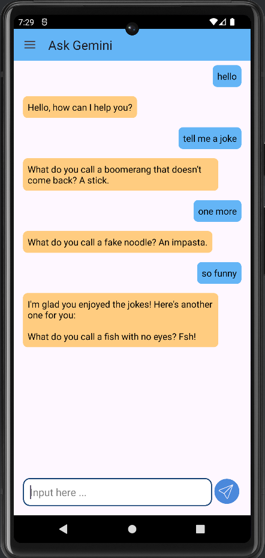
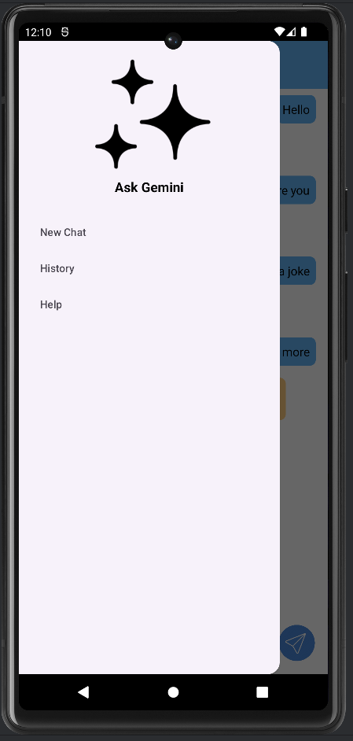
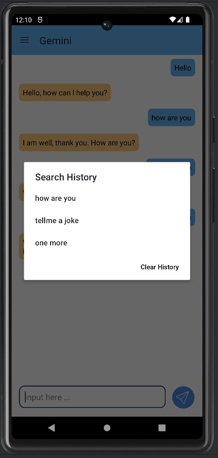

# Ask Gemini Chat Bot

Ask Gemini is a chat bot application developed in Kotlin that utilizes the Gemini API for responding to user prompts. 
The application allows users to interact with the chat bot, view chat history, start new chats, search through chat history, and clear chat history.

## Features

- **Chat Bot Interaction**: Users can submit prompts and receive responses from the Gemini chat bot.
- **Chat History**: View all previous chats in a RecyclerView.
- **Start New Chat**: Users can initiate a new chat through the navigation drawer.
- **Search History**: Users can search through chat history and view previous responses.
- **Clear History**: Option to clear all chat history.

## Screenshot

## Technologies Used

- Kotlin: The primary programming language for Android development.
- Gemini API: Used for implementing the chat bot functionality.
- RecyclerView: Displaying chat history in a scrollable list.
- Navigation Drawer: For navigation between different sections of the application.
- sharedPreferences: Storing chat history locally on the device.

## Installation

1. Clone this repository
2. Open the project in Android Studio.
3. Build and run the application on an Android device or emulator.

## Usage

1. Launch the application on your Android device.
2. Use the navigation drawer to start a new chat, view chat history, or clear history.
3. Submit prompts in the chat interface to interact with the Gemini chat bot.
4. Search through chat history by entering keywords in the search bar.

## Contributing

Contributions are welcome! If you have any suggestions, bug fixes, or feature implementations, please submit a pull request.
